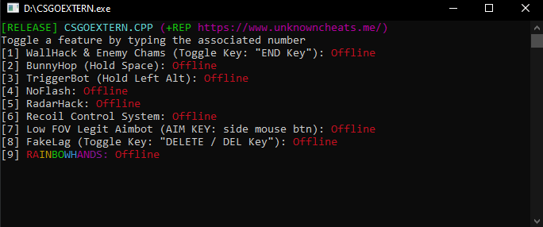
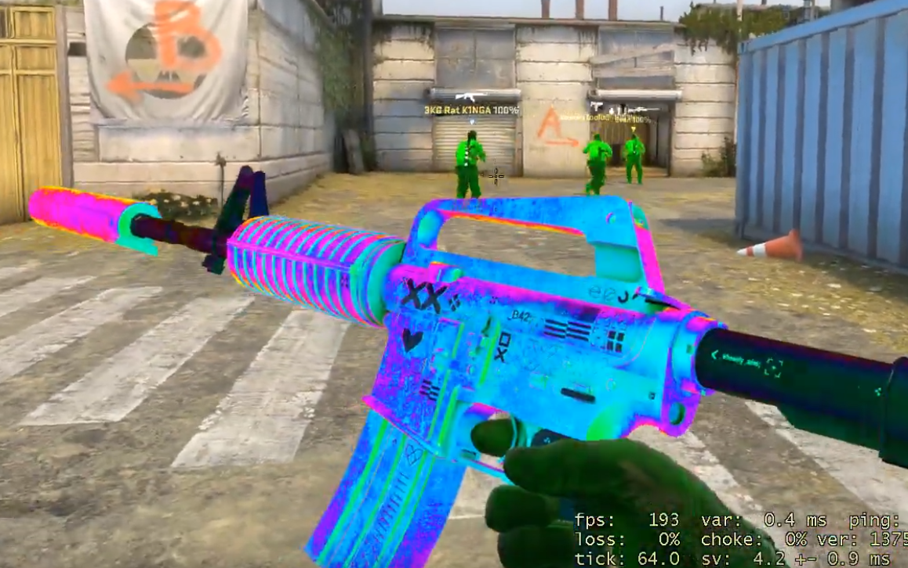

# CSGO External MultiCheat
External MultiCheat project created as an educational introduction to binary reverse engineering and ethical hacking. Built using C++ and Win32 libraries. This cheat is detected by Valve Anti Cheat (VAC) if you would like to learn more I suggest reading [this](https://guidedhacking.com/threads/how-to-bypass-vac-valve-anti-cheat-info.8125/) article for more information. 

## Visuals
- Character Chams (RGB & Brightness)
- NoFlash
- Glow Wallhack (VAC detected feature, your account will be flagged)
- Viewmodel / Hand Chams 

## Aim
- Triggerbot
- Recoil Control System
- Low FOV Aimbot with mouse smoothing

## Misc 
- RadarHack (VAC detected feature, your account will be flagged)
- NoHands 
- BunnyHop
- Fakelag 

# Showcase

https://user-images.githubusercontent.com/24901604/236889629-66c1bd7d-d44d-4f01-bbd5-1940246bfc2f.mp4

